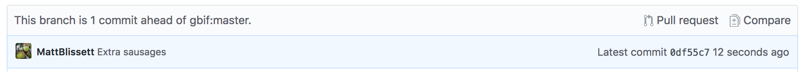

For this step, again choose pairs, ideally someone you didn't collaborate with
on the previous exercise.

This time, one person will be the "Owner" and the other
will be the "Requester". The goal is that the Requester add changes into
the Owner's repository, but using a pull request. We will switch roles at the end, so both persons will
play Owner and Requester.

The Requester needs to make their own copy of the Owner's repository, on GitHub.
On GitHub, go to the Owner's repository and click "Fork" at the top right.

This creates a second copy (really a clone) in the Requester's GitHub account.
Next, the Requester needs to download a copy of this repository to her
 machine. The Collaborator enters:

~~~
$ git clone https://github.com/breakfastcollaborator/breakfast.git
~~~
{: .bash}

Replace the URL with the correct URL from the owner.

The Requester can now make a change in her clone of the Owner's repository,
exactly the same way as we've been doing before:

~~~
$ cd ~/Desktop/breakfast
$ nano ingredients.txt
$ cat ingredients.txt
~~~
{: .bash}

~~~
2 eggs
salt
4 sausages
butter
pepper
½ tomato
~~~
{: .output}

~~~
$ git add ingredients.txt
$ git commit -m "extra sausages"
~~~
{: .bash}

~~~
 [master 7fb6b7e] extra sausages
 1 file changed, 1 insertion(+)
~~~
{: .output}

Then push the change to your clone of the repository GitHub:

~~~
$ git push
~~~
{: .bash}

~~~
Counting objects: 5, done.
Delta compression using up to 4 threads.
Compressing objects: 100% (2/2), done.
Writing objects: 100% (3/3), 337 bytes | 0 bytes/s, done.
Total 3 (delta 0), reused 0 (delta 0)
To https://github.com/breakfastmaster/breakfast.git
   f237e9f..7fb6b7e  master -> master
~~~
{: .output}

Take a look at *your* copy of the repository on its GitHub website now (maybe you need
to refresh your browser.) You should be able to see the new commit, and the button "Pull Request".

You see the changes between the original version, and yours.  Click "Create pull request".

The Owner now gets an email, and a new entry in the "Pull request" section on Github.  This can be used
to discuss the changes, track further improvements, and, when the Owner is satisfied, "Merge pull request".
